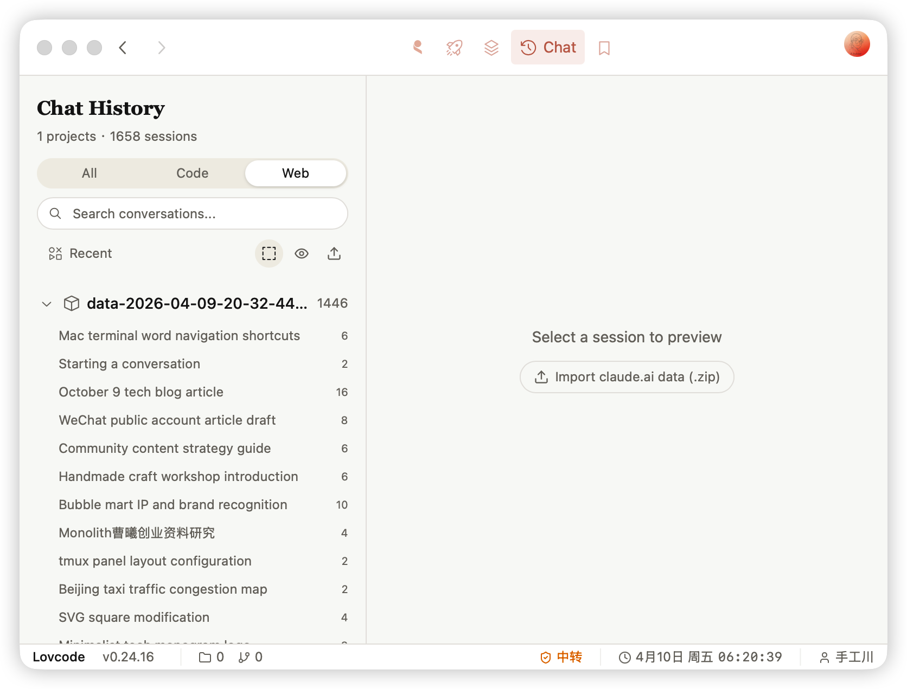

<p align="center">
  
</p>

<h1 align="center">
  
  Lovcode
</h1>

<p align="center">
  <strong>Desktop companion for AI coding tools</strong><br>
  <sub>macOS • Windows • Linux</sub>
</p>

<p align="center">
  
  
  
  
</p>

---

<p align="center">
  <a href="#release-highlights">Updates</a> •
  <a href="#features">Features</a> •
  <a href="#oh-my-lovcode">oh-my-lovcode</a> •
  <a href="#installation">Installation</a> •
  <a href="#usage">Usage</a> •
  <a href="#tech-stack">Tech Stack</a> •
  <a href="#license">License</a>
</p>

---

## Release Highlights

### v0.31.0 — Page-Centric Refactor

Workspace dashboard removed in favor of a flat, page-centric router. `/chat/*` is now `/history/*`; knowledge sources moved from a static reference page to dynamic `/knowledge/source/[id]` routes. Session list streams instead of blocking on a full scan, and the splash now waits for the first list page to actually be ready.



| Version | Highlights |
|---------|------------|
| **0.31.0** | Architecture refactor: removed Workspace dashboard (PanelGrid, FeatureTabs, KanbanBoard, GitHistory, LogoManager, ProjectDashboard) in favor of page-centric routing; `/chat/*` → `/history/*`; `/knowledge/reference` (static) → `/knowledge/source/[id]` (dynamic) with `[...docPath]` sub-routes; new `useStreamedSessions` hook for streamed session list rendering; splash now waits for `/history` `ProjectList` `app:ready` signal before dismissing; LLM provider settings page removed |
| **0.30.1** | Patch: silence dev-mode `[TAURI] Couldn't find callback id` warnings — defer `get_network_info` to next macrotask, persist `NETWORK_INFO_CACHE` to `~/.lovstudio/lovcode/cache/network.json` so dev restarts keep the cache; annual-report-2025 no longer recorded as `lastPath` resume target |
| **0.30.0** | Chat session list & global search overhaul: `readLiteMetadata`-aligned head/tail 64KB title scanner with `title_source` field surfaced as a multi-purpose dot in the list (custom black / AI terracotta / summary blue / slug green / prompt grey / none faded); fix consecutive same-role user messages being merged; built-in slash commands (`/clear`, etc.) now format correctly even with reordered `<command-name>` tags; new `GlobalChatSearch` overlay + `search-overlay` route for cross-session full-text search; double-click a user prompt opens it in a standalone `prompt-detail` webview; Recent header toolbar always visible (`SlidersHorizontal` icon); session metadata extraction switched from full-JSON parse to byte-level scan, dramatically faster on tens-of-MB sessions |
| **0.29.0** | MaaS registry: new `Vendor` entity separates model vendors (anthropic/openai) from access platforms (zenmux/modelgate); tokens now stored inline (migrated from `authEnvKey`) with a verified-fingerprint stamp; models gain description / icon / modalities / context-window metadata; `fetchCommand` for remote model-list pull; Settings/MaaS view rewritten; inline provider/model picker in the chat input footer with a 5-slot MRU persisted across sessions |
| **0.28.0** | Session detail footer shows provider · model · peak context-window occupancy (input + cache aggregate); `messages` count switched to `rounds` (user prompts only); markdown `[text](path)` links resolve through smart PathLink (existence-checked + context menu); router restores last page on reload instead of forcing Dashboard |
| **0.27.0** | Data source split into `cli` / `app-code` / `app-web` / `app-cowork` with two-level tabs; bottom inline input to continue a session; merge consecutive same-role messages; GFM tables + code-block syntax highlighting in chat |
| **0.26.0** | Sidebar refactor — Pinned / Recent / Import groups + Algolia-style ⌘K search; live sync of claude.ai web chats (Cookies + Keychain decrypt → API pull); Pinned tri-state toggle mirrored to Claude desktop `starredIds` |
| **0.25.0** | MaaS provider registry (`/settings/maas`) with 4 Tauri commands; new `/events` page; LLM provider presets extracted; standalone Home consolidated into Workspace |
| **0.24.16** | Import claude.ai web exports (.zip/dir), data source tabs (All / Code / Web) |
| **0.24.15** | Structured content blocks — view tool calls, thinking, tool results |
| **0.24.14** | Full-text search with jieba Chinese tokenization |
| **0.24.12** | Two-column master-detail layout with grouped/flat toggle |
| **0.24.11** | In-app auto-updater |
| **0.24.7** | Session usage tracking with token counts and cost estimation |
| **0.24.0** | File-system routing architecture, settings split into sub-pages |

[Full Changelog](CHANGELOG.md)


## Features

- **Chat History Viewer** — Browse and search conversation history across all projects with full-text search (Chinese + English)
- **Granular Data Sources** — Switch between `cli` (Claude Code) / `app-code` / `app-web` / `app-cowork` with two-level tabs
- **Live claude.ai Sync** — Pull web conversations directly via decrypted cookies (no manual export needed); also supports `.zip` / directory import
- **Continue From the Bottom** — Reply to a session inline without leaving the detail view
- **Rich Markdown Rendering** — GFM tables and syntax-highlighted code blocks (Warm Academic theme) inside chat messages
- **Smart Path Links** — Bare paths *and* markdown `[text](path)` links are existence-checked against the session `cwd`; matches open in editor / Finder via right-click menu
- **Live Context-Window Readout** — Session detail footer shows the active model, provider, and peak context-window occupancy (input + cache_read + cache_creation) per round
- **Structured Content Blocks** — Tool calls, thinking, and tool results rendered as first-class blocks
- **Sidebar with Pinned / Recent / Import** — Tri-state Pinned toggle mirrored to Claude desktop `starredIds`; Algolia-style ⌘K search
- **MaaS Registry** — Manage custom Model-as-a-Service providers with vendor/model hierarchy, inline tokens, Verify fingerprinting, and remote model-list pull (`/settings/maas`)
- **Inline Model Picker** — Switch active provider · vendor · model from the chat input footer; MRU remembers your last 5 picks across sessions
- **Commands / MCP / Skills / Hooks / Sub-Agents / Output Styles** — Full configuration surface for the Claude Code ecosystem
- **Marketplace** — Browse and install community templates
- **Customizable Statusbar** — Personalize your statusbar display with scripts

## oh-my-lovcode

Community configuration framework for Lovcode, inspired by oh-my-zsh.

```bash
curl -fsSL https://raw.githubusercontent.com/lovstudio/oh-my-lovcode/main/install.sh | bash
```

Share and discover statusbar themes, keybindings, and more at [oh-my-lovcode](https://github.com/lovstudio/oh-my-lovcode).

## Installation

### From Release

Download the latest release for your platform from [Releases](https://github.com/lovstudio/lovcode/releases).

### From Source

```bash
# Clone the repository (with submodules)
git clone --recursive https://github.com/lovstudio/lovcode.git
cd lovcode

# Install dependencies
pnpm install

# Run development
pnpm tauri dev

# Build for distribution
pnpm tauri build
```

## Usage

1. Launch Lovcode
2. Select **History** — sidebar shows Pinned / Recent / Import; ⌘K to search (or open Global Chat Search via the configured hotkey)
3. Use the two-level tabs to switch data source: `cli` / `app-code` / `app-web` / `app-cowork`
4. Open a session: tool calls / thinking / GFM tables / code blocks render inline; reply at the bottom to continue
5. Live-sync claude.ai web chats from your logged-in browser, or import a `.zip` / folder export
6. Manage commands, MCP servers, skills, hooks, sub-agents, output styles, and MaaS providers under **Configuration**
7. Visit **Marketplace** to discover community templates

## Tech Stack

| Layer | Technology |
|-------|------------|
| Frontend | React 19, TypeScript, Tailwind CSS, Vite |
| Backend | Rust, Tauri 2 |
| UI Components | shadcn/ui |
| State | Jotai |
| Search | Tantivy + jieba (full-text, Chinese-aware) |

## Star History

[](https://star-history.com/#lovstudio/lovcode&Date)

## License

Apache-2.0
